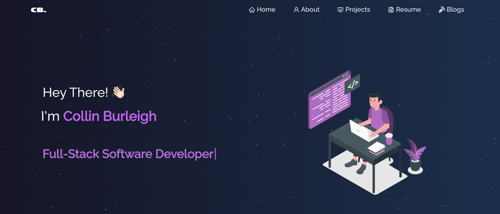

# Portfolio Website

Welcome to the source code of my personal portfolio website! This site is a representation of my skills, projects, and experiences in the tech industry, built with a focus on modern web development practices and design principles.

## Features

- **Responsive Design**: Ensures the website looks great on all devices.
- **Dynamic Portfolio Projects**: Showcases my work through interactive elements and detailed case studies.
- **About Me Section**: Offers insights into my professional journey and skill set.
- **Options to Connect**: Provides simple ways for potential clients or employers to reach out to me.
- **Resume**: A downloadable version of my professional resume is available, providing a comprehensive overview of my skills, experiences, and accomplishments in the tech industry.

## Technologies Used

- **React.js**: For building a dynamic and interactive user interface.
- **Node.js & Express.js**: Powers the backend services for features like the contact form.
- **CSS3**: Styles the site with modern layout techniques including Flexbox and Grid.
- **VsCode**: The code editor of choice for writing and managing the project's codebase.
- **Vercel**: Used for hosting the website, ensuring fast loading times and a secure connection.

